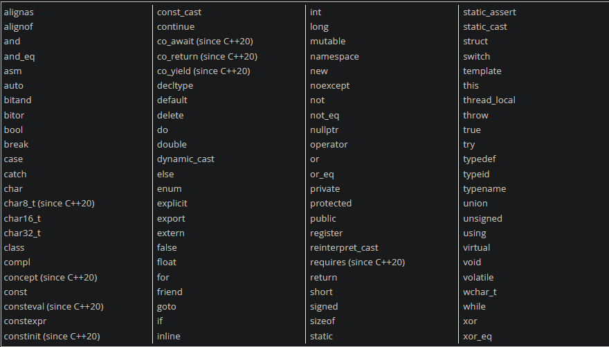

**Statements**
- Declaration Statements
- Jump statements
- Expression statements
- Compound statements
- Selection statements (conditionals)
- Iteration statements (loops)
- Try blocks


**Every C++ program must have a special function named `main`. Statements inside `main` are executed in sequential order**


## Dissecting Hello World
```cpp
#include <iostream>

int main()
{
   std::cout << "Hello world!";
   return 0;
}
```
`std::cout` stands for character output from the standard library and the << operator displays information on the console.


**Comment code liberally, and write comments as if speaking to someone who has no idea what the code does**


## Objects and Variables
When we run a program the OS loads the program into RAM. The OS reserves some additional RAM for the program to use while running.

An **object** is a region of storage (usually memory) that can store a value and has other associated properties. An object with a name (identifier) is called a **variable**

C++ is **strongly-typed** and variable type cannot be changed at runtime.

It is possible to define multiple variables of the **same type** in a single statement as follows:
```cpp
int a;
int b;
```
is the same as :
```cpp
int a, b;
```
However, it is still good practice to declare each var in a separate statement and line.


## Initialization and assignment
Many ways to initialize variables in cpp:
```cpp
int a;         // no initializer (default initialization)
int b = 5;     // initial value after equals sign (copy initialization)
int c( 6 );    // initial value in parenthesis (direct initialization)

// List initialization methods (C++11) (preferred)
int d { 7 };   // initial value in braces (direct list initialization)
int e = { 8 }; // initial value in braces after equals sign (copy list initialization)
int f {};      // initializer is empty braces (value initialization)
```

Prefer to use the 3 types of list initialization as it is more efficient. List initialization also catches narrowing conversions instead of rounding off the information. Eg trying to initialize an int to 4.5 will produce an error using list initialization, but regular initialization will just truncate to 4.

``int width {}; // value initialization / zero initialization to value 0``
This initializes the value to the zero value (or empty) rather than uninitialized

Reference for multiple variable initializaiton
```cpp
int a = 5, b = 6;          // copy initialization
int c( 7 ), d( 8 );        // direct initialization
int e { 9 }, f { 10 };     // direct brace initialization
int g = { 9 }, h = { 10 }; // copy brace initialization
int i {}, j {};            // value initialization
```


C++17 onwards : `[[maybe_unused]]` attribute
Consider the case where we have a bunch of math/physics values that may not get used. We can add the attribute in front of the variable type to indicate it might be unused as follows : 
```cpp
int main()
{
    [[maybe_unused]] double pi { 3.14159 };
    [[maybe_unused]] double gravity { 9.8 };
    [[maybe_unused]] double phi { 1.61803 };

    // the above variables will not generate unused variable warnings

    return 0;
}
```


## Intro to iostream: cout, cin, and endl
**std::cout**
standard charater output to send data to console to be printed as text. Can also print strings, numbers, variables

```cpp
#include <iostream> // for std::cout

int main()
{
    std::cout << 4; // print 4 to console

    return 0;
}
```
This produces `4`

```cpp
#include <iostream> // for std::cout

int main()
{
    int x{ 5 }; // define integer variable x, initialized with value 5
    std::cout << x; // print value of x (5) to console
    return 0;
}
```
This produces `5`

You can concatenate multiple items in a single line by chaining >>
```cpp
#include <iostream> // for std::cout

int main()
{
    int x{ 5 };
    std::cout << "x is equal to: " << x;
    return 0;
}
```
This produces `x is equal to: 5`


**Using std::endl to output a newline**
Explicitly use `std::endl` to print newline or cout will keep printing on the same line regardless of when it was called.
```cpp
#include <iostream> // for std::cout and std::endl

int main()
{
    std::cout << "Hi!" << std::endl; // std::endl will cause the cursor to move to the next line
    std::cout << "My name is Alex." << std::endl;

    return 0;
}
```
This prints:
```
Hi!
My name is Alex.
```


**std::cout is buffered**
std::cout does not immediately send to console. The output is collected in a region of memory known as the buffer, and the buffer is periodically **flushed** and the data is sent collectively to the destination (console). This means if the program aborts before the buffer is flushed, any output waiting in the buffer will not be displayed.

Buffering can significantly increase performance by batching multiple output requests together to minimize the number of times output has to be sent to the output device


**Preferably, use \n instead of endl as endl clears the buffer as well which makes it inefficient if you keep having to print it**


**std::cin**
Standard character input reads input from keyboard using the extraction operator (`>>`). The input must be stored in a variable to be used.

```cpp
#include <iostream>  // for std::cout and std::cin

int main()
{
    std::cout << "Enter a number: "; // ask user for a number

    int x{};       // define variable x to hold user input (and value-initialize it)
    std::cin >> x; // get number from keyboard and store it in variable x

    std::cout << "You entered " << x << '\n';
    return 0;
}
```
Note that the user must press enter to get the input accepted as enter will force the newline.


You can also cin multiple variables:
```cpp
#include <iostream>  // for std::cout and std::cin

int main()
{
    std::cout << "Enter two numbers separated by a space: ";

    int x{}; // define variable x to hold user input (and value-initialize it)
    int y{}; // define variable y to hold user input (and value-initialize it)
    std::cin >> x >> y; // get two numbers and store in variable x and y respectively

    std::cout << "You entered " << x << " and " << y << '\n';

    return 0;
}
```


## Uninitialized variables and undefined behavior
C++ does not auto initialize variables to a given value (such as zero) for performance reasons. When a variable that is not initialized is given a memory address to store data, the default value of the variable is whatever (garbage) value happens to already be in that memory address.


## Keywords


Identifier naming rules:
- Cannot be keyword
- Can only be composed of upper/lowercase letters, numbers, and underscore
- Must begin with a letter or underscore. Cannot start with a number
- C++ is case-sensitive

Conventions:
- Names start in lowercase
- Either snake_case or camelCase (stdlib uses snake_case)
- Avoid names starting with underscore, as those names are typically reserved for OS, library, or compiler use
- Identifier should be clear in what value they are holding (variable names should make sense)
- Length of name should be proportional to how widely it is used. If it is used trivially, it can have a short name, but if it used more broadly, it should have a longer and more descriptive name
- Use comments above the declaration to provide more explicit information, rather than trying to cram everything in the var name


C++ is whitespace-independent (unlike python)